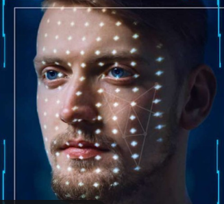

# 🎭 DeepFake Detection Platform

[](https://www.python.org/downloads/)
[](https://reactjs.org/)
[](https://nodejs.org/)
[](https://opensource.org/licenses/MIT)

<div align="center">
  
</div>

## 🌟 Features

- 🔒 **Secure Authentication** - User registration and login system
- 📤 **Easy Upload** - Drag-and-drop video upload interface
- 🤖 **Real-time Analysis** - Advanced AI-powered deepfake detection
- 🎨 **Modern UI/UX** - Beautiful interface with smooth animations
- 📱 **Responsive Design** - Works seamlessly on desktop and mobile
- 🔐 **API Security** - Protected endpoints with JWT authentication

## 🚀 Tech Stack

### Frontend
- **React** - Modern UI library
- **TailwindCSS** - Utility-first CSS framework
- **Framer Motion** - Animation library
- **React Router** - Navigation
- **Context API** - State management

### Backend
- **Node.js** - Runtime environment
- **Express** - Web framework
- **MongoDB** - Database
- **JWT** - Authentication
- **Multer** - File upload

### ML/AI
- **PyTorch** - Deep learning framework
- **OpenCV** - Image processing
- **NumPy** - Numerical computations
- **Scikit-learn** - Machine learning utilities

## 📂 Project Structure

```
├── frontend/           # React frontend application
│   ├── src/           # Source code
│   ├── public/        # Public assets
│   └── package.json   # Frontend dependencies
│
├── backend/           # Node.js backend server
│   ├── routes/       # API routes
│   ├── middleware/   # Custom middleware
│   ├── models/       # Database models
│   ├── ml/          # ML model integration
│   └── uploads/      # File uploads directory
│
├── ml/               # Machine Learning components
│   ├── model.py      # Core ML model definition
│   ├── train_model.py # Training script
│   └── preprocess.py # Data preprocessing utilities
│
├── tests/            # Testing files
│   ├── test_model.py # Model tests
│   ├── inspect_model.py # Model inspection utilities
│   └── test_videos/  # Test video files
│
├── scripts/          # Utility scripts
│   └── download_test_videos.py # Video download utility
│
├── assets/           # Static assets
│   └── image.png
│
└── logs/            # Application logs

```

## 🛠️ Installation

### Prerequisites
- Python 3.8+
- Node.js 14+
- MongoDB
- CUDA-capable GPU (recommended)

### Frontend Setup
```bash
cd frontend
npm install
npm start
```

### Backend Setup
```bash
cd backend
npm install
# Create .env file with required variables
node server.js
```

### ML Setup
```bash
cd ml
pip install -r requirements.txt
python train_model.py  # For training the model
```

## 🔧 Configuration

### Backend Environment Variables
Create a `.env` file in the backend directory:
```env
MONGODB_URI=your_mongodb_uri
JWT_SECRET=your_jwt_secret
PORT=5000
```

### Frontend Environment Variables
Create a `.env` file in the frontend directory:
```env
REACT_APP_API_URL=http://localhost:5000
```

## 📊 Model Training Data

The model training data is not included in this repository due to size constraints. To obtain the training data:

1. Download the FaceForensics++ dataset (contact authors for access)
2. Place the videos in `backend/ml/data/raw/`
3. Run preprocessing scripts:
   ```bash
   cd backend/ml
   python preprocess.py
   ```

## 🔌 API Endpoints

### Authentication
- `POST /api/auth/register` - User registration
- `POST /api/auth/login` - User login

### Video Analysis
- `POST /api/videos/upload` - Upload video for analysis
- `GET /api/videos/analysis/:id` - Get analysis results

## 🤝 Contributing

1. Fork the repository
2. Create your feature branch (`git checkout -b feature/amazing-feature`)
3. Commit your changes (`git commit -m 'Add amazing feature'`)
4. Push to the branch (`git push origin feature/amazing-feature`)
5. Open a Pull Request

## 📝 License

This project is licensed under the MIT License - see the [LICENSE](LICENSE) file for details.

## 🙏 Acknowledgments

- FaceForensics++ dataset team for training data
- PyTorch team for the deep learning framework
- Open-source community for various tools and libraries

## 📧 Contact

Your Name - [@your_twitter](https://twitter.com/your_twitter) - email@example.com

Project Link: [https://github.com/YASHSALI2005/DEEPFAKE-DETECTION-MODEL](https://github.com/YASHSALI2005/DEEPFAKE-DETECTION-MODEL)

---
<div align="center">
  Made with ❤️ by YASHSALI2005
</div>
